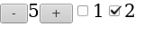

# hello-perspective

This is a sandbox for my little experiment - a new possible way
of component composition.

With some stuff from the `src/Lib.elm` you can compose your widgets:

```elm
main =
    beginnerProgram
        { model = Counter.model <> CheckBox.mkModel "1" <> CheckBox.mkModel "2"
        , view = Counter.view <|> CheckBox.view <|> CheckBox.view
        , update = Counter.update <&> CheckBox.update <&> CheckBox.update
        }
```

and have an app what looks like this:



(Here is a [live demo](https://astynax.github.io/hello-perspective/index.html)).
